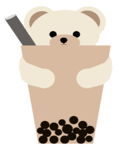

# **Tea N Me**

## **COMP 1170 | Set H**

Corey, Harman, Jenny, Joey, Kaitlyn, Sara

 

## **About Our Website**

> We created a static informational website for a fictional bubble tea company called Tea N Me. Our website runs on localhost:3000 using [Express.JS](https://expressjs.com/).
 

## **Sitemap**
<ul>
<li>Homepage (Corey)
<li>Menu page (Harman)
<li>About Us page (Kaitlyn)
<li>Online Ordering page (Sara, Jenny)
</ul>
 

## **Other features**
<ul>
<li>Figma (Jenny, Kaitlyn, Sara)
<li>Logo design (Jenny)
<li>Express.JS, file structure (Joey)
<li>Navigation bar, footer (Joey)
<li>Back to top button (Joey)
<li>README.md (Joey)
</ul>
 

## **Changes made after presentations**

### Homepage
<ul>
<li>Slowed down background colour change animation per feedback
<li>Corrected item spacing
</ul>

### Navigation bar
<ul>
<li>Added mobile responsiveness with functional drop-down navigation menu
<li>Adjusted "ORDER ONLINE" button colours to stand out more
</ul>

### Back to Top button
<ul>
<li>Added a back to top button for desktop view
</ul>

### Online Ordering page
<ul>
<li>Created the horizontal list
<li>Added more flex
<li>Updated the lists and checkboxes
</ul>

### About Us page
<ul>
<li>Added flex and padding to text boxes <li>changed some of the layout
</ul>